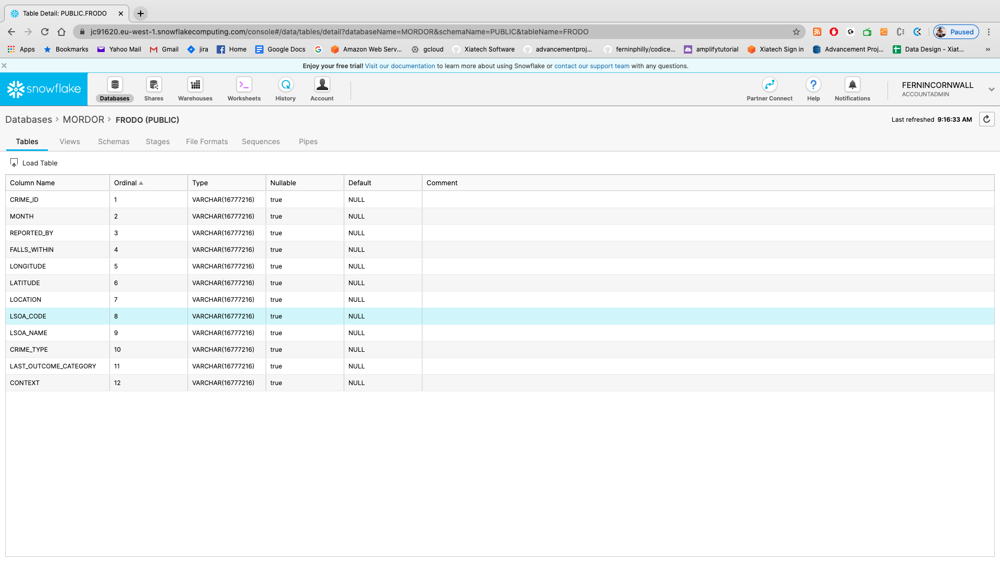
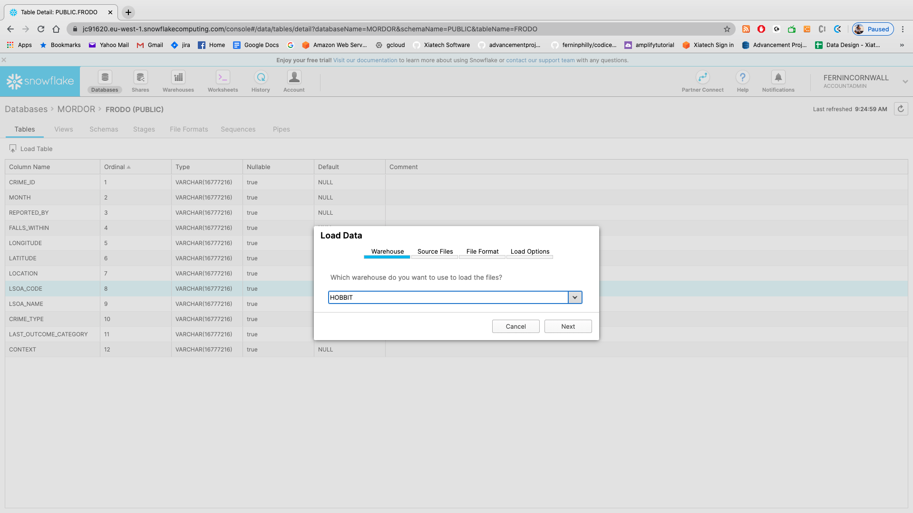
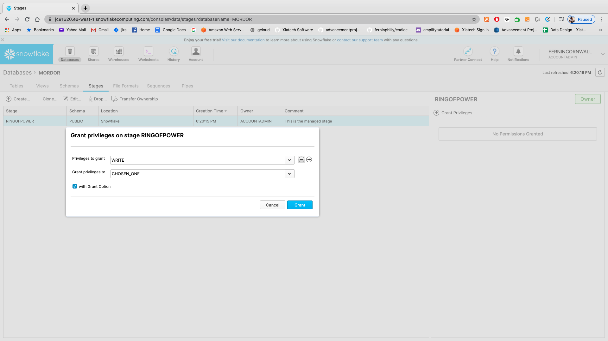

# Lab Three

## Loading data into Snowflake

There are multiple ways to do most things in most code bases and Snowflake is no different. We're going to start with the web GUI and also go through the SQL method.

### Loading in the WEB GUI

SO...the first step is to create a database. Based on our last lesson let's go through all of the steps to create a database and a user to have access to that database. 

We're going to review each of these commands so please follow along:

```sql
USE ROLE ACCOUNTADMIN;
CREATE DATABASE mordor;
USE DATABASE mordor;
CREATE WAREHOUSE hobbit
    WAREHOUSE_SIZE = XSMALL
    ;
CREATE ROLE chosen_one;
GRANT USAGE ON DATABASE mordor TO ROLE chosen_one;
GRANT CREATE SCHEMA ON DATABASE mordor TO ROLE chosen_one;
GRANT ALL ON SCHEMA mordor.PUBLIC TO ROLE chosen_one;
GRANT ALL ON ALL TABLES IN SCHEMA mordor.PUBLIC TO ROLE chosen_one
CREATE or replace USER frodo PASSWORD='precious' DEFAULT_ROLE = chosen_one DEFAULT_WAREHOUSE='mordor';
GRANT ROLE chosen_one TO USER frodo;
GRANT ALL ON WAREHOUSE hobbit TO chosen_one;

```


Okay...excellent. So we have our hero (FRODO) and we have our MORDOR. NOW...we need to fill it up with data! (umm....ORCS?)


OKAY! So the first thing we need to do is create a table to manage our data! 

Let's take a quick look at the data we'll be loading in here so that we have the metadata that we can use to create our table. Go ahead and open up (or download the lab data directly from github) the file in `developintelligence_snowflake/Module_03/Lab_03/lab_data/2020-03-devon-and-cornwall-street.csv`

Note the headers there. Let's go ahead and create the table to hold our "orc crimes".

```sql
CREATE TABLE mordor.PUBLIC.samwise (
    crime_id string,
    month string,
    reported_by string,
    falls_within string,
    longitude string,
    latitude string,
    location string,
    lsoa_code string,
    lsoa_name string,
    crime_type string,
    last_outcome_category string,
    context string
)

STAGE_FILE_FORMAT = (TYPE = 'csv' FIELD_DELIMITER= '/t')

```

NOW- notice the portion at the bottom: **STAGE_FILE_FORMAT**. Note that _this is going to be used to mark the primary methodology by which we will be loading data_
SO...in our case we're going to be using csv so, obviously, csv is the method. 

Okay...so first method of loading is going to be through the web GUI. The first thing you will want to do click on the "databases" icon next to the snowflake logo:


Okay...from here we need to choose database **mordor** (where our table exists). _It is possible that you do not see this listed in your databases!_

### CHALLENGE ONE: IF YOU DON'T SEE THE DATABASE HERE...WHERE COULD YOU GO TO SEE IT? DOES IT EXIST? (ANSWER BELOW)

Hint: Switch roles to the role that would allow you to see **all** warehouses

Okay...so choose DATABASES -> MORDOR -> TABLES

Choose FRODO and you should see a screen like this



Once you choose the table you will see a list of columns. Let's choose "LOAD TABLE" from the section under the __Tables__ mark. Click on that. First question: Which warehouse? (HOBBIT)



Select the file in **lab_data** in this module (assuming you've downloaded this git repo) called **./developintelligence_snowflake/Module_03/Lab_03/lab_data/2020-03-devon-and-cornwall-street.csv**. LET'S LOAD THOSE ORC CRIMES

**IT'S POSSIBLE** that you might need to create a new method for csv (not guaranteed) where CSV is the default. Go ahead and do that. 

Once loaded return to your main screen and run `SELECT * FROM mordor.public.samwise` to see the data.


### LOADING FROM THE COMMAND LINE

OKAY! SO let's see if we can log in from our command line. 

### CHALLENGE TWO: GOING BACK TO THE FIRST LAB- UPDATE THE ~/.snowsql/config FILE AND LOG IN TO THE MORDOR DATABASE WITH USER FRODO. YOU WILL NEED TO REFERENCE BACK TO LAB ONE AND THE CODE ABOVE.

The first thing we'll want to do here is to empty out our table to see if we can reload it. 
Now that we are logged in see if you can.
Keep in mind you might have to `USE mordor` and maybe even `USE ROLE ACCOUNTADMIN`. Possibly. 
Okay...`TRUNCATE TABLE SAMWISE`.


Okay...so do a `SELECT * FROM SAMWISE` 
Hopefully that returned zero rows and we're ready to carry on.

So now let's PREPARE your data. I want to demonstrate another neat aspect of Snowflake:
Obviously when bulk loading data from a source we'll want to compress it first.

NOW...there are two steps to pushing data into snowflake from SNOWSQL. FIRST we need to push everything to a STAGE...which is basically the STAGING ground before the full load. This is where the files live before being loaded into the full SQL table.
So let's do this first from the web GUI. Go to `DATABASES` and choose `MORDOR`.
One level down from that click on the **stages** tab. You should get to a screen that looks like this.


Choose **Snowflake Managed**. We'll go over in the lecture all of the different staging environments (we can pull data from S3, Azure, Google, etc)..but for now, for simplicities' sake, let's do **Snowflake Managed**

Create a stage called **RINGOFPOWER**. 


We'll obviously need to grant permissions to our user so on the right side of the screen grant WRITE privileges to **CHOSEN_ONE**. Go ahead and give **GRANT OPTION.**



Oh SHOOT! Did you get an ERROR?

### CHALLENGE THREE: GRANT BOTH READ AND WRITE ACCESS TO THE STAGE TO CHOSEN_ONE

SO...the stage is the intermediary between our local file and the sql table. Let's get everything into our stage _first_. 

We'll use the **PUT** command to do this...so go back to your command line SNOWSQL terminal and type out the following (replacing variables with your local data):

`PUT file:///Users/fernandopombeiro/github_projects/developintelligence_snowflake/Module_03/Lab_03/lab_data/2020-03-devon-and-cornwall-street.csv @ringofpower; `

Obviously- replace MY home directory with the directory where you put your copy of the repo above.

We'll go through the section after the '@' there now...but this is the command that basically moves your file up into the "staging" section of snowflake. 
BUT...how can we be sure that the files made it up there??

Run this:

`list @ringofpower`

Do you see your file up there?


Okay...so now the second step- which is to move the data here into the table - is done with the `COPY` command. Let's do a sample of that now: 

`copy into SAMWISE from @ringofpower/2020-03-devon-and-cornwall-street.csv FILE_FORMAT=(TYPE = 'CSV' SKIP_HEADER=1);`

Okay...let's go ahead and run `SELECT * FROM mordor.public.samwise limit 10` on your command line. 
Did you get stuff back? 


Note where we explicitly state the file. 
BUT WHAT IF WE WANT TO LOAD MULTIPLE FILES???

Well- we can also add in a Parameter to the COPY command after we move data into our stage. Let's say we want to move a BUNCH of files up to our stage. Well fortunately wildcard characters (*, ?) are supported to enable uploading multiple files in a directory.

SO...we could do the same run as:

`PUT file:///Users/fernandopombeiro/github_projects/developintelligence_snowflake/Module_03/Lab_03/lab_data/* @ringofpower/multiple; `

And when we want to do our copy:


`copy into SAMWISE from @ringofpower/2020-03-devon-and-cornwall-street.csv FILE_FORMAT=(TYPE = 'CSV' SKIP_HEADER=1)`


Congratulations! We can now bulk load in two ways. Let's examine one more!
Run this command:

`!exit`

...and you should get back to your terminal

### CHALLENGE FOUR: OKAY! Now it's YOUR TURN! Get the three files in the three_months folder in lab_data up to your snowflake database. Create tables/databases/users as necessary!

## Uploading with PYTHON

Okay...so our final methodology for interacting 
